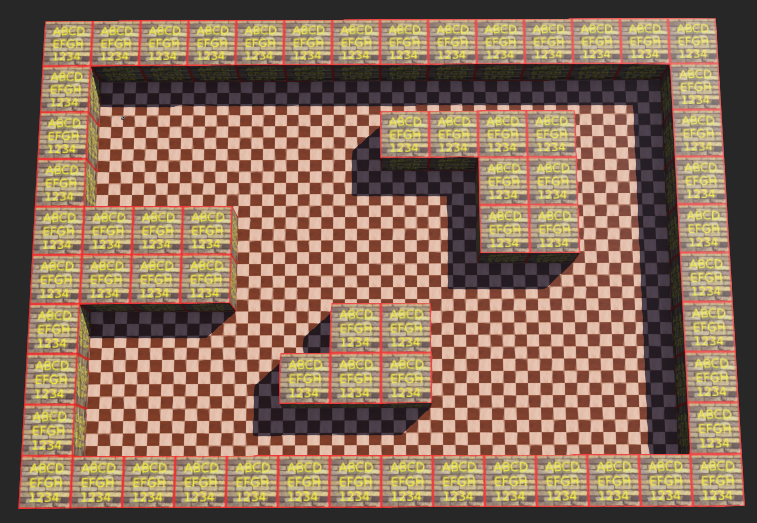
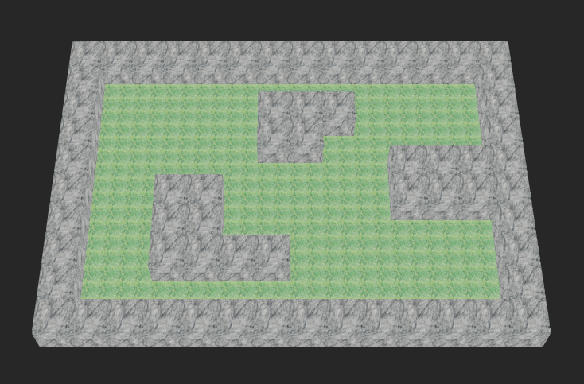

# webots-tools

# Project Overview

This project features a custom CSV map generated based on my name, **Victor Rosillo Suero**. The system integrates multiple sensors and provides a robust API for data processing and visualization. Additionally, the GUI has been enhanced with texture customization for the map display.

## Custom map

1,1,1,1,1,1,1,1,1,1,1,1,1,1
1,0,0,0,0,0,0,0,0,0,0,0,0,1
1,0,0,0,0,0,0,1,1,1,1,0,0,1
1,0,0,0,0,0,0,0,0,1,1,0,0,1
1,1,1,1,0,0,0,0,0,1,1,0,0,1
1,1,1,1,0,0,0,0,0,0,0,0,0,1
1,0,0,0,0,0,1,1,0,0,0,0,0,1
1,0,0,0,0,1,1,1,0,0,0,0,0,1
1,0,0,0,0,0,0,0,0,0,0,0,0,1
1,1,1,1,1,1,1,1,1,1,1,1,1,1

This is the original map, created using the script **webots-map-from-csv_R2022b.py**

Using the new script I have implemented to create a map with textures

## Implemented Sensors

The system includes the following sensors:

- **GPS Sensor**: Used to obtain precise location data.
- **IMU (Inertial Measurement Unit) Sensor**: Provides orientation, acceleration, and angular velocity data.

## API

The project includes an API with the following functionalities:

- `getGPSData()` - Retrieves real-time GPS coordinates.
- `getIMUData()` - Fetches IMU sensor readings.
- `updateMap()` - Updates the displayed map based on new data.
- `setMapTexture(texturePath)` - Allows changing the map's texture dynamically.
- `logSensorData()` - Stores sensor data for analysis and debugging.

## GUI Changes

Significant improvements have been made to the GUI, including:

- **Map Texture Customization**: Users can now change the textures of the map for better visualization and user experience. You could change textures including new images. To create the new map with textures you have to run **map_from_scv_textures.py** script.
- **Improved Sensor Data Display**: Real-time sensor readings are now viewed on webots terminal.

This project ensures an enhanced mapping experience with real-time data integration and user-friendly visualization tools.

## Notes

- [Upgrade from R2023a to R2023b](https://cyberbotics.com/doc/guide/from-2023a-to-2023b): No relevant changes
- [Upgrade from R2022a to R2022b](https://cyberbotics.com/doc/guide/from-2022a-to-2022b): EXTERNPROTO
- [Upgrade from R2021b to R2022a](https://cyberbotics.com/doc/guide/from-2021b-to-2022a): Changes in orientation
