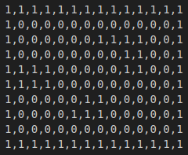

# Project Webots

This project features a custom CSV map generated based on my name, **Victor Rosillo Suero**. The system integrates multiple sensors and provides a robust API for data processing and visualization. Additionally, the GUI has been enhanced with texture customization for the map display.

## Custom map

The result of creating a map using my surname is this map in csv:

This is the original map, created using the script **webots-map-from-csv_R2022b.py**

Using the new script I have implemented to create a map with textures

## Implemented Sensors

The system includes the following sensors:

- **GPS Sensor**: Used to obtain precise location data.
- **IMU (Inertial Measurement Unit) Sensor**: Provides orientation, acceleration, and angular velocity data.
- **Position Sensor (Encoder)**: Used to obtain the odometry.
- **Distance Sensor**: Used to avoid obstacles.

## API

The project includes these functionalities:

### API webots extras
- **Position Sensor (Encoder)**: Implement a position controller on each wheel to update the odometry. Moreover, it's useful to compare the odometry with the GPS output for redundancy. (7.5%)
- **Distance Snesor**: Implement 4 laser distance sensor, two in the front, and one on each side. The controller use them to change the system state.(7.5%) 

### Constant variables
- `lineal_speed`- The maximum lineal speed for this robot is 6.28.
- `position_tol`- Position tolerance to perform the movement.
- `angle_tol`- Anngle tolerance to turn the robot.

### Movement
- `run_trajectory()`- Changes the state to perform the optimal trajectory.
- `move_forward()` - Moves the robot forward at a constant speed.
- `move_backward()` - Moves the robot backward at a constant speed.
- `turn_left()` - Rotates the robot to the left.
- `turn_right()` - Rotates the robot to the right.
- `stop()` - Stops the robot's movement.

### Sensor Functions
- `getGPS()` - Retrieves real-time GPS coordinates.
- `getInertialUnit()` - Fetches IMU sensor readings.
- `getMotor()` - Create motor object for each wheel.
- `setVelocity()` - Allows changing the motor velocity dynamically.
- `setPosition()` - Set the motor position.

### Trajectory States
The robot follows a state-based trajectory system:

- `MOVING_X` - Moves along the X-axis towards the target.
- `MOVING_Y` - Moves along the Y-axis towards the target.
- `TURNING_LEFT` - Rotates left when a direction change is needed.
- `TURNING_RIGHT` - Rotates right when aligning back to the X-axis.
- `ARRIVED` - Stops moving once the target location is reached.

## GUI extra

Significant improvements have been made to the GUI, including:

- **Map Texture Customization**: Users can now change the textures of the map for better visualization and user experience. You could change textures including new images. To create the new map with textures you have to run **map_from_scv_textures.py** script. (2.5%)

## Notes

- [Upgrade from R2023a to R2023b](https://cyberbotics.com/doc/guide/from-2023a-to-2023b): No relevant changes
- [Upgrade from R2022a to R2022b](https://cyberbotics.com/doc/guide/from-2022a-to-2022b): EXTERNPROTO
- [Upgrade from R2021b to R2022a](https://cyberbotics.com/doc/guide/from-2021b-to-2022a): Changes in orientation

